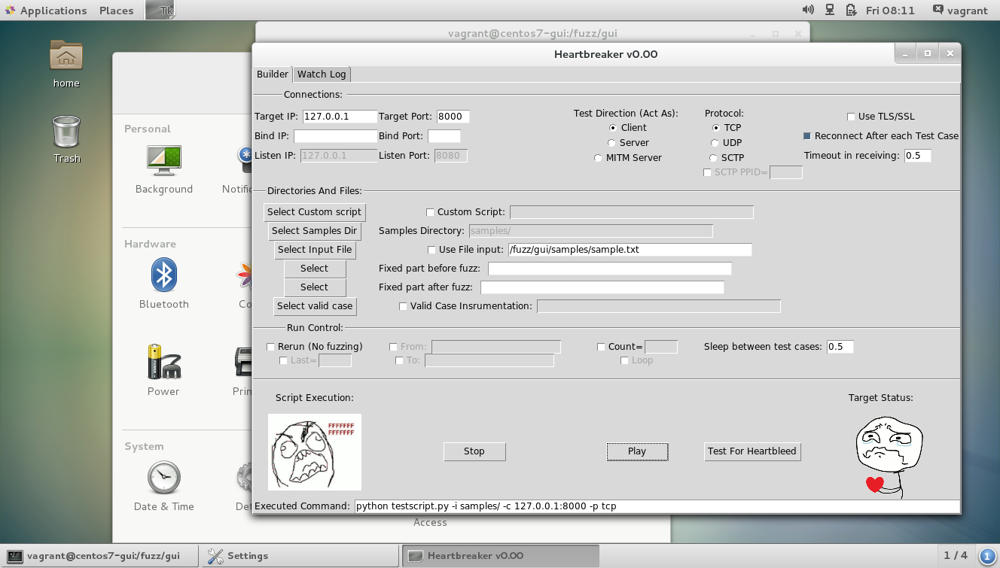

# What is Heartbreaker ?

Heartbreaker is a simple GUI for Radamsa which makes fuzz testing HTTP servers easier and more user friendly. It is a work-in-progress and 
contributions are very welcome!

Credits:

* The Heartbreaker GUI is written in Python by Jussi Rämö. 
* [Radamsa](https://github.com/aoh/radamsa) is a fuzzing engine written by Aki Helin.
* [Swizzfuzz](https://github.com/ouspg/swissfuzz/) is a project of OUSPG
* virtual machine setup scripts for the GUI by Antti Virtanen.
* The name and some of the visual design refers to the infamous [Heartbleed bug](http://heartbleed.com/) found by Codenomicon (Synopsys).

# How to install ?

We recommend installing this as a virtual machine. This repository contains setup sripts for [Vagrant](https://www.vagrantup.com/) for Ubuntu based virtual machine you can use.

1. cd vagrant
2. vagrant up hbreaker
3. log in, open terminal
4. sudo su -
5. cd /fuzz
6. ./setup-heartbreaker.sh

Now you should have everything inside the virtual machine good to go.

## Testing the installation

Use vagrant user. Running as root is not necessary or recommended.

1. python -m SimpleHTTPServer & (starts a HTTP server in port 8000 at background)
2. cd gui
3. python heartbreaker.py
4. Choose "act as client", port 8000, from the samples dir sample.txt and press play

# How does it look like

Here's the UI running at the virtual machine.

# License

This repository contains Radamsa and Swizzfuzz. Radamsa is distributed under MIT License as are the contributions in this repository (GUI + vagrant setup scripts).

