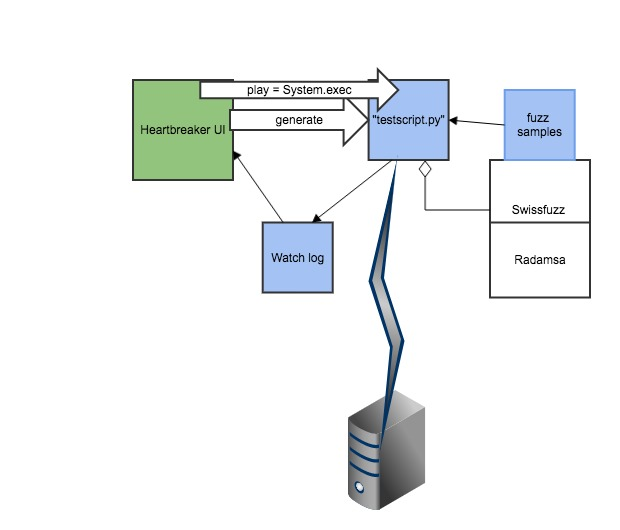

# What is Heartbreaker ?

Heartbreaker is a simple GUI for Radamsa which makes fuzz testing of any client or server protocol on TCP, SCTP or UDP easier and more user friendly. It is a work-in-progress and contributions are very welcome!

The name and some of the visual design refers to the goal of crashing the remote application (break it's heart).
Also, as an addition, it includes is a test for infamous [Heartbleed bug](http://heartbleed.com/) found by Codenomicon (Synopsys). The  code for that test is adopted from internet, Original PoC by Jared Stafford (jspenguin@jspenguin.org).

# How does it work

Heartbreaker is a not only a GUI for [Radamsa](https://github.com/aoh/radamsa) fuzzing engine, rather it's a GUI for generating fuzzers you can run from the command line. It generates Python code that can be used without the GUI. Interface to Radamsa is handled by the [Swissfuzz](https://github.com/ouspg/swissfuzz) Python library through the file system. This is not the most elegant way, but works reasonably well for simple purposes.

**High level overview**

The GUI generates Python code, which it runs as an external process through the operating system. The GUI can see how the fuzzing happens through a log file, which also serves as a record for interesting test cases if something is found. This is a bit messy, but also allows you to use Heartbreaker to simply generate templates to create customized special fuzzers for your own purposes.

## How code is generated

Code is based on templates, such as this: (https://github.com/lokori/heartbreaker/blob/master/gui/nonmitm-testscript.template)

The template contains placeholders which are replaced by the GUI according to parameters set by the user. The replace is a two-pass process: first pass may generate new placeholders which are replaced during the second pass. 

The idea is to make templates and code generation understandable and also enable tweaking the templates easily.

# How to install ?

We recommend installing this as a virtual machine. This repository contains setup sripts for [Vagrant](https://www.vagrantup.com/) for Ubuntu based virtual machine you can use.

1. cd vagrant
2. vagrant up hbreaker

Now you should have everything inside the virtual machine good to go.

## Testing the installation

Use vagrant user. Running as root is not necessary or recommended. Log in and open terminal.

1. python -m SimpleHTTPServer & (starts a HTTP server in port 8000 at background)
2. cd /fuzz/gui
3. python heartbreaker.py
4. Choose "act as client", port 8000, from the samples dir sample.txt and press play

# How does it look like

Here's the UI running at the virtual machine.

# Credits:

* The Heartbreaker GUI is written in Python by Jussi Rämö. Some refactoring by Antti Virtanen.
* [Radamsa](https://github.com/aoh/radamsa) is a fuzzing engine written by Aki Helin.
* [Swissfuzz](https://github.com/ouspg/swissfuzz/) is a project of OUSPG.
* Virtual machine setup scripts for the GUI by Antti Virtanen.

# License

This repository contains Radamsa and Swizzfuzz. Radamsa is distributed under MIT License as are the contributions in this repository (GUI + vagrant setup scripts).

